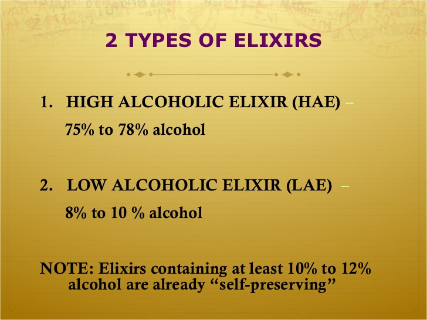

---?color=#ffffff

---?color=#3DED20

---?color=#F62020

---?color=#ffffff

---

## Типови спецификации и поведения
(Typespecs and Behaviours)

---



---

## Съдържание

1. Типова спецификация(type specification)
  * Видове
  * Синтаксис
  * Дефиниране на собствени
2. Поведения(Behaviours)
  * dynamic dispatch

---

### Но първо!

---

#### Замисляли ли сте се?

---?image=assets/thinking.png&size=auto 90%

---

#### Хората в Хасково ...

---?image=assets/thinking.png&size=auto 90%

---

#### ...пишат ли на Хаскел?

---?image=assets/troll.jpg&size=auto 90%

---

#### единствения отговор, който получих:

---?image=assets/answer.png&size=auto 50%

---

### Типови спецификации

---

### Type specification

---

### Typespecs

---

### Типспец?

---

"Звучи доста спечено"

---?image=assets/troll.jpg&size=auto 90%

---

#### съжалявам, че ще ви разочаровам...

---

##### ... не ни правят кода по-бърз

---

Elixir идва с нотация за типове.

---

Изглеждат така:

```
@type age :: pos_integer()
@type sex :: :female | :male
@type location :: String.t()
@type asl :: {age(), sex()}
```

---

Функциите са така:
```elixir
defmodule Foo do
  @spec is_even(integer) :: true | false
  def is_even(x), do: # ... не знам как
end
```

---

Използват се главно за:

  * да допринасят за документация(инструменти като [ExDoc](https://github.com/elixir-lang/ex_doc) ги ползват)
  * от инструменти като [Dialyzer](http://erlang.org/doc/man/dialyzer.html) за анализ на кода за грешки
  * когато пишем библиотеки за други хора
  * текстовите редактори

---

### Типове и техния синтаксис

---

##### Като цяло са същите като в Erlang с още малко отгоре!

---

##### [Straight outta docs](https://hexdocs.pm/elixir/typespecs.html)  
PS1: Гледаме документацията тук

---

#### Използване  

PS1: Live coding starts here  
PS2: Time for behaviours  

---?image=assets/dialyzer.png&size=auto 70%

---

### Поведения(behaviours)

---?image=assets/behaviour.jpg&size=auto 90%

---

##### Начин да разделим абстракцията от имплементацията.

---?image=assets/what.gif&size=auto 70%

---

Поведенията ни дават начин да правим две неща:
  * даден модул имплементира разни функции
  * осигурява, че са имплементирани

---

Ако се налага -  мислите за тях като интерфейсите в **!нормалните** езици.

---

#### ok, нави ме, как го правим?

---

Да кажем, че бихме искали да напишем поведение за парсване на JSON/MsgPack(случайност).

---

Как би изглеждало това?

---

```elixir
defmodule Parser do
  @callback encode(term) :: {:ok, String.t} | {:error, String.t}
  @callback decode(String.t) :: {:ok, term} | {:error, String.t}
end
```

---

И след това го вмъкваме в нашите имплементации по този начин:

```
defmodule JSON do
  @behaviour Parser

  def encode(term), do: # ... encode
  def decode(str), do: # ... decode
end

defmodule MsgPack do
  @behaviour Parser

  def encode(term), do: # ... encode
  def decode(str), do: # ... decode
end
```

---

### Dynamic dispatch

---

Можем динамично да решаваме кога да извикаме даден модул.

---

Нищо не ни пречи да направим следното:

---

```elixir
defmodule Parser do
  # ... rest of code ...

  def encode!(implementation, term) do
    implementation.encode(term)
  end
end

Parser.encode!(JSON, term)
```

---

Вече можем в run-time да избираме какъв формат ни трябва!

---

... чакай малко ...

---

### Behaviours vs Protocols

---?image=assets/fight.jpg&size=auto 90%

---

Двете не правят ли близки неща?

---

Разликите:
  * протоколите ни дават полиморфизъм над типове/дата
  * поведенията ни дават динамично да се включваме където ни трябва

---

Един вид - протоколите са поведения + логика за dynamic dispatch

---?image=assets/beers.jpg&size=auto 90%
